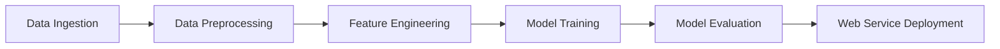

# Microsoft Azure & Cloud ML Projects Portfolio

## Executive Summary

This repository showcases advanced expertise in **Microsoft Azure Machine Learning** and **AWS cloud platforms** through five comprehensive projects demonstrating end-to-end machine learning workflows. The portfolio highlights proficiency in computer vision, predictive modeling, MLOps, and multi-cloud architecture, with validated completion through Coursera specialization certificates.

## 🏗️ Cloud Architecture Expertise

### Multi-Cloud Proficiency
* **Microsoft Azure ML Studio**: Visual drag-and-drop ML workflows
* **Amazon SageMaker**: Managed ML platform and model deployment
* **AWS S3**: Scalable object storage and data lake architecture
* **Cross-Platform Integration**: Hybrid cloud ML solution development

### Enterprise ML Operations
* **End-to-End Pipelines**: Data ingestion through model deployment
* **Model Operationalization**: Production-ready web service deployment
* **Infrastructure as Code**: Reproducible cloud resource management
* **Cost Optimization**: Efficient resource utilization across cloud platforms

## 📊 Project Portfolio Overview

| Project | Technology Stack | Domain | Certification |
|---------|------------------|--------|---------------|
| [Image Classification with TensorFlow](#1-image-classification-with-tensorflow) | AWS SageMaker, TensorFlow, Python | Computer Vision | [Coursera LSHYBZZP7GPZ](Coursera%20LSHYBZZP7GPZ.pdf) |
| [ML Pipeline with Azure ML Studio](#2-machine-learning-pipeline-with-azure-ml-studio) | Azure ML Studio, Boosted Decision Trees | MLOps & Deployment | [Coursera SWFN8GZ967RK](Coursera%20SWFN8GZ967RK.pdf) |
| [Object Detection with SageMaker](#3-object-detection-with-sagemaker) | AWS SageMaker, Deep Learning, Computer Vision | Object Detection | [Coursera 4RMLQSD6Z4GW](Coursera%204RMLQSD6Z4GW.pdf) |
| [Predictive Modeling with Azure ML](#4-predictive-modeling-with-azure-ml-studio) | Azure ML Studio, Feature Engineering | Predictive Analytics | [Coursera MMCVJYGBMLR3](Coursera%20MMCVJYGBMLR3.pdf) |
| [Random Forest in R with Azure](#5-random-forest-in-r-with-azure-ml-studio) | Azure ML Studio, R Programming | Statistical Modeling | [Coursera GPFVP85MY9NP](Coursera%20GPFVP85MY9NP.pdf) |

## 🚀 Project Deep Dive

### 1. Image Classification with TensorFlow
**Platform**: AWS SageMaker | **Technology**: TensorFlow, Python | **Domain**: Computer Vision

#### Technical Architecture
```python
# Core components implemented
├── Data Pipeline: S3 → SageMaker → Training
├── Model: TensorFlow CNN Architecture
├── Training: Distributed GPU-enabled training
└── Deployment: SageMaker Endpoint Services
```

#### Key Technical Achievements
* **Deep Learning Implementation**: Custom TensorFlow convolutional neural networks
* **Scalable Data Processing**: Automated data generators for large-scale image datasets
* **AWS Infrastructure**: SageMaker notebook instances with S3 integration
* **Production Deployment**: Model endpoint creation and inference optimization

#### Business Applications
* **Computer Vision Systems**: Automated image categorization and classification
* **Quality Control**: Industrial inspection and defect detection
* **Content Moderation**: Automated image content filtering and analysis

#### Technical Implementation
* **Data Engineering**: Automated download, preprocessing, and augmentation
* **Model Architecture**: Custom CNN design with transfer learning capabilities
* **Training Optimization**: GPU-accelerated distributed training workflows
* **MLOps Integration**: Seamless S3 storage and SageMaker ecosystem integration

---

### 2. Machine Learning Pipeline with Azure ML Studio
**Platform**: Microsoft Azure ML Studio | **Technology**: Boosted Decision Trees | **Domain**: MLOps

 

#### Enterprise ML Workflow


#### Technical Competencies Demonstrated
* **Advanced Preprocessing**: Automated data cleaning and transformation modules
* **Algorithm Optimization**: Hyperparameter tuning for boosted decision trees
* **Class Balancing**: Statistical techniques for imbalanced dataset handling
* **Production Deployment**: Azure web service creation and API management

#### Enterprise Value Delivered
* **Automated Workflows**: Drag-and-drop visual ML pipeline development
* **Scalable Infrastructure**: Cloud-native model training and deployment
* **Business Integration**: RESTful API endpoints for enterprise application integration
* **Monitoring & Maintenance**: Built-in model performance tracking and alerting

---

### 3. Object Detection with SageMaker
**Platform**: AWS SageMaker | **Technology**: Deep Learning, Computer Vision | **Domain**: Object Detection

#### Advanced Computer Vision Pipeline
* **Data Annotation**: Professional-grade object labeling and bounding box creation
* **Deep Learning Models**: State-of-the-art object detection algorithms
* **Distributed Training**: Multi-GPU training with automatic scaling
* **Real-time Inference**: Low-latency prediction endpoints

#### Technical Implementation Highlights
```python
# Key workflow components
def object_detection_pipeline():
    # Data preparation and visualization
    visualize_annotated_data()
    
    # SageMaker environment setup
    configure_sagemaker_estimator()
    
    # Multi-channel training data preparation
    prepare_training_channels()
    
    # Model deployment and endpoint creation
    deploy_inference_endpoint()
```

#### Industry Applications
* **Autonomous Systems**: Self-driving car object recognition
* **Security & Surveillance**: Automated threat and anomaly detection
* **Retail Analytics**: Customer behavior and product interaction analysis
* **Manufacturing**: Automated quality inspection and defect identification

---

### 4. Predictive Modeling with Azure ML Studio
**Platform**: Microsoft Azure ML Studio | **Technology**: Predictive Analytics | **Domain**: Flight Operations


#### Advanced Predictive Analytics Workflow
* **Complex Data Integration**: Multi-source data fusion (flight + weather data)
* **Feature Engineering**: Advanced temporal and categorical feature creation
* **Target Leak Prevention**: Sophisticated data validation and integrity checks
* **Weather Data Integration**: External API integration and real-time data processing

#### Technical Excellence Demonstrated
* **Data Quality Management**: Missing value imputation and outlier detection
* **Feature Transformation**: Categorical encoding and numerical scaling
* **Temporal Analysis**: Time-based feature engineering for flight operations
* **Model Validation**: Cross-validation and performance metric optimization

#### Business Impact
* **Operational Efficiency**: Proactive flight delay prediction and resource allocation
* **Customer Experience**: Enhanced passenger communication and service delivery
* **Cost Optimization**: Dynamic pricing and resource planning based on predictions
* **Risk Management**: Weather-based operational decision support systems

---

### 5. Random Forest in R with Azure ML Studio
**Platform**: Microsoft Azure ML Studio | **Technology**: R Programming | **Domain**: Statistical Modeling


#### Advanced Statistical Modeling
* **Custom R Integration**: Professional R script development within Azure ecosystem
* **Ensemble Methods**: Random Forest algorithm implementation and optimization
* **Statistical Preprocessing**: Advanced outlier detection and removal techniques
* **Model Interpretability**: Feature importance analysis and statistical inference

#### R Programming Excellence
```r
# Core R functionalities implemented
* Advanced data preprocessing and cleaning
* Custom feature engineering functions
* Statistical outlier detection algorithms
* Random Forest model training and evaluation
* Comprehensive model performance analysis
```

#### Statistical Rigor
* **Robust Preprocessing**: Statistical outlier detection and treatment
* **Feature Selection**: Information-theoretic feature importance ranking
* **Model Validation**: Bootstrap validation and confidence interval estimation
* **Performance Metrics**: Comprehensive regression evaluation framework

## 🛠️ Technical Stack Mastery

### Cloud Platforms & Services
```yaml
Microsoft Azure:
  * Azure ML Studio (Classic)
  * Azure ML Designer
  * Azure Web Services
  * Azure Storage Integration

Amazon Web Services:
  * SageMaker (Notebooks, Training, Endpoints)
  * S3 (Object Storage, Data Lakes)
  * EC2 (Compute Instances)
  * IAM (Security & Access Management)
```

### Programming Languages & Frameworks
* **Python**: TensorFlow, scikit-learn, pandas, NumPy
* **R**: Statistical modeling, data preprocessing, ensemble methods
* **SQL**: Data querying and transformation
* **REST APIs**: Web service integration and deployment

### Machine Learning Specializations
* **Computer Vision**: CNN architectures, image classification, object detection
* **Statistical Modeling**: Regression, classification, ensemble methods
* **Feature Engineering**: Automated and custom feature creation
* **Model Deployment**: Production-ready inference endpoints

## 📈 Professional Certifications & Validation

### Coursera Specialization Certificates
| Certificate ID | Project Focus | Skills Validated |
|----------------|---------------|------------------|
| **LSHYBZZP7GPZ** | TensorFlow Image Classification | Deep Learning, AWS SageMaker |
| **SWFN8GZ967RK** | Azure ML Pipeline Development | MLOps, Model Deployment |
| **4RMLQSD6Z4GW** | SageMaker Object Detection | Computer Vision, Cloud ML |
| **MMCVJYGBMLR3** | Azure Predictive Modeling | Feature Engineering, Predictive Analytics |
| **GPFVP85MY9NP** | R Programming with Azure | Statistical Modeling, R Integration |

### Demonstrated Competencies
* **Multi-Cloud Architecture**: Expertise across Azure and AWS platforms
* **End-to-End ML Workflows**: Complete pipeline development and deployment
* **Production ML Systems**: Scalable, enterprise-ready model deployment
* **Cross-Technology Integration**: Python, R, and visual development tools

## 🎯 Business Value & Impact

### Enterprise Solutions Delivered
* **Computer Vision Systems**: Automated image and object recognition capabilities
* **Predictive Analytics**: Business forecasting and decision support systems
* **MLOps Infrastructure**: Scalable model development and deployment pipelines
* **Cross-Platform Integration**: Hybrid cloud ML architecture implementation

### Cost & Efficiency Optimization
* **Cloud Resource Management**: Efficient utilization of pay-per-use cloud services
* **Automated Workflows**: Reduced manual intervention through visual ML pipelines
* **Scalable Architecture**: Elastic compute resources based on demand
* **Rapid Prototyping**: Accelerated model development through cloud-native tools

## 🔄 Continuous Innovation & Learning

### Emerging Technology Integration
* **AutoML Capabilities**: Automated model selection and hyperparameter tuning
* **MLOps Best Practices**: CI/CD pipelines for machine learning workflows
* **Edge Computing**: Model optimization for deployment at the edge
* **Explainable AI**: Model interpretability and transparency frameworks

### Industry Trend Adaptation
* **Hybrid Cloud Strategies**: Multi-cloud ML architecture design
* **Sustainable AI**: Green computing practices for ML workloads
* **Responsible AI**: Ethical AI development and bias mitigation
* **Real-time ML**: Low-latency inference and streaming analytics

---

*This portfolio demonstrates comprehensive expertise in cloud-based machine learning, spanning multiple platforms, technologies, and industry applications. Each project represents production-ready capabilities validated through industry-recognized certifications and practical implementation experience.*
